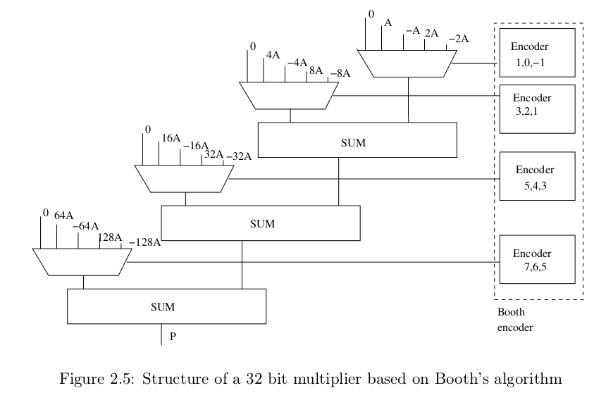

# Booth Multiplier Implementation with P4 Pentium Adder

This repository contains an efficient implementation of a **Booth Multiplier** leveraging a **P4 Pentium Adder** for high-speed arithmetic operations. Designed in VHDL, the project is modular, reusable, and supported by detailed testbenches and performance reports to validate its functionality and efficiency.



## Repository Structure

The project is organized as follows:

```
.
├── README.md
├── report
│   ├── boothmul_8_timing_10.txt
│   ├── boothmul_8_timing.txt
│   ├── BOOTHMUL_analysis.txt
│   ├── mul-area-no-opt.txt
│   ├── mul-area-opt.txt
│   ├── mul-timing-no-opt.txt
│   ├── mul-timing-opt.txt
│   ├── mult_timeopt_1a.rpt
│   ├── mult_timeopt_1t.rpt
│   ├── mult_timeopt_2a.rpt
│   ├── mult_timeopt_2t.rpt
├── sim
│   ├── modelsim.ini
│   ├── simulation.tcl
│   ├── vsim.wlf
│   └── work
│       ├── _info
│       ├── _lib1_0.qdb
│       ├── _lib1_0.qpg
│       ├── _lib1_0.qtl
│       ├── _lib.qdb
│       └── _vmake
├── src
│   ├── BOOTHMUL.vhd
│   ├── carry_generator.vhd
│   ├── constants.vhd
│   ├── cs_generic.vhd
│   ├── encoder.vhd
│   ├── fa.vhd
│   ├── G_block.vhd
│   ├── iv.vhd
│   ├── mux21_generic.vhd
│   ├── mux51_generic.vhd
│   ├── nd2.vhd
│   ├── p4_adder.vhd
│   ├── PG_block.vhd
│   ├── PG_network.vhd
│   ├── rcaN.vhd
│   └── sum_gen_generic.vhd
└── tb
    ├── mul-wave.pdf
    └── tb_multiplier.vhd
```

- **`README.md`**: This documentation file.
- **`report/`**: Contains performance analysis and optimization reports for the multiplier, such as timing results (`boothmul_8_timing_10.txt`, `boothmul_8_timing.txt`) and area/timing optimizations (`mul-area-no-opt.txt`, `mul-area-opt.txt`, `mult_timeopt_1a.rpt`, etc.).
- **`sim/`**: Contains the simulation environment:
  - `modelsim.ini`: Simulator configuration file.
  - `simulation.tcl`: TCL script to automate simulation steps.
  - `vsim.wlf`: Waveform output file for viewing results.
  - `work/`: Directory containing compiled design files and intermediate data generated during simulation.
- **`src/`**: Includes the VHDL source files for the Booth Multiplier and its subcomponents:
  - `BOOTHMUL.vhd`: The main multiplier implementation.
  - `carry_generator.vhd`, `sum_gen_generic.vhd`: Modules for sum and carry signal generation.
  - `p4_adder.vhd`: P4 Pentium Adder implementation for high-speed addition.
  - `mux21_generic.vhd`, `mux51_generic.vhd`: Multiplexers used in the design.
  - `encoder.vhd`: Booth encoder for partial product generation.
  - Additional modules for propagation/generation logic (`PG_block.vhd`, `PG_network.vhd`), arithmetic operations (`fa.vhd`, `rcaN.vhd`), and more.
- **`tb/`**: Contains testbench files:
  - `tb_multiplier.vhd`: Testbench for verifying the multiplier’s functionality.
  - `mul-wave.pdf`: Captured waveform snapshot from a simulation run.

## Running the Simulation

### Prerequisites

Ensure you have **ModelSim** or **QuestaSim** installed and set up in your environment. Other VHDL-compatible simulators may work but have not been tested.

### Steps to Simulate

1. Clone the repository and navigate to the `sim` directory:
   ```bash
   git clone https://github.com/username/booth_multiplier
   cd booth_multiplier/sim
   ```

2. Run the TCL simulation script:
   ```bash
   vsim -do simulation.tcl
   ```

3. The script will perform the following tasks:
   - Create and clean the `work` directory.
   - Compile the RTL source files from `src/`.
   - Compile the testbench (`tb_multiplier.vhd`) from `tb/`.
   - Load the design and add signals to the waveform viewer.
   - Run the simulation for **1000 ns**.

4. View the waveform results using the simulator's GUI:
   - Open the `vsim.wlf` file to analyze the multiplier’s behavior and verify correctness.

### How the `simulation.tcl` Script Works

The script automates the entire process of preparing and running the simulation. Key operations include:

- **Library Setup**: Creates and maps the `work` library for storing compiled files.
- **RTL Compilation**: Iterates through a predefined list of VHDL source files to compile into the `work` library.
- **Testbench Compilation**: Compiles the `tb_multiplier.vhd` file, ensuring the multiplier can be thoroughly tested.
- **Waveform Configuration**: Automatically adds all signals to the waveform viewer for debugging.
- **Simulation Execution**: Runs the simulation for 1000 ns, capturing results in the `vsim.wlf` file.

## Features of the Booth Multiplier

- **Booth Encoding**: Reduces the number of partial products in multiplication for enhanced efficiency.
- **P4 Pentium Adder**: Enables fast summation operations, inspired by the Intel P4 processor architecture.
- **Modular Design**: All components are reusable and adaptable for various multiplier configurations.
- **Performance Optimizations**: Detailed timing and area analysis ensure the design is both fast and resource-efficient.

## Example Waveforms

Below is an example of the expected output waveform:

The waveform highlights:

- Accurate Booth encoding of input operands.
- Partial product summation using the P4 Pentium Adder.
- Final product computation within the expected timing constraints.

## Acknowledgments

This project draws inspiration from modern processor architectures, such as the Intel Pentium P4, to deliver a high-performance multiplier design. The implementation is modular and flexible, making it suitable for integration into larger digital systems.


